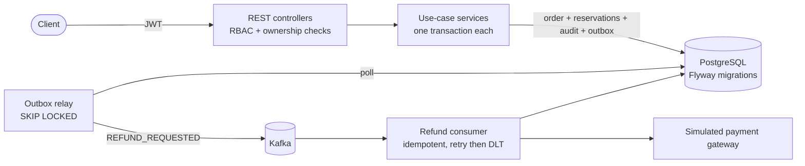

# Order Management System

[](https://github.com/5exclamations/order-management-system/actions/workflows/ci.yml)

Spring Boot 3.5 / Java 21 order management backend: customers, catalog, inventory with stock reservation, an order
state machine, simulated payments, cancellation and an event-driven refund workflow, with audit logging.

Stack: Spring Security (JWT + RBAC), Spring Data JPA, PostgreSQL, Flyway, Kafka, springdoc OpenAPI,
JUnit 5, Testcontainers, Docker, GitHub Actions.

## Architecture

A single Spring Boot service (modular monolith, package-by-feature). The consistency rules need one database
transaction per use case, so there are no microservices; Kafka carries side effects that may happen later.



| Concern | Decision |
|---|---|
| Overselling | `@Version` on inventory; the whole use case is retried on conflict, outside the transaction |
| Double charging | `SELECT ... FOR UPDATE` on the order before the irreversible payment call |
| Duplicate requests | `Idempotency-Key` row inserted in the same transaction as the work, unique per scope, request hash checked |
| Lost events | Transactional outbox instead of dual writes; consumers tolerate at-least-once delivery |
| Refund over-run | Committed refund total on a versioned payment row plus a database check constraint |

Full rationale and known limitations: [docs/ARCHITECTURE.md](docs/ARCHITECTURE.md). State machine and refund sequence:
[docs/ORDER_LIFECYCLE.md](docs/ORDER_LIFECYCLE.md).

## Quick start

```bash
docker compose up -d                       # Postgres :5433, Kafka :29092
SPRING_PROFILES_ACTIVE=dev mvn spring-boot:run
```

Swagger UI: http://localhost:8080/swagger-ui.html. The `dev` profile seeds `admin@oms.local` and `staff@oms.local`
(password from `DEV_SEED_PASSWORD`, default `DevPassw0rd!`) and three products. Run everything in containers with
`docker compose --profile app up --build`.

## Try it

```bash
T=$(curl -s localhost:8080/api/v1/auth/register -H 'content-type: application/json' \
  -d '{"email":"me@example.com","password":"Passw0rd!x","name":"Me"}' | jq -r .accessToken)
S=$(curl -s localhost:8080/api/v1/auth/login -H 'content-type: application/json' \
  -d '{"username":"staff@oms.local","password":"DevPassw0rd!"}' | jq -r .accessToken)
P=$(curl -s localhost:8080/api/v1/products -H "authorization: Bearer $T" | jq -r '.content[0].id')
O=$(curl -s localhost:8080/api/v1/orders -H "authorization: Bearer $T" -H 'content-type: application/json' \
  -H "Idempotency-Key: $(uuidgen)" -d "{\"items\":[{\"productId\":\"$P\",\"quantity\":2}]}" | jq -r .id)
curl -s localhost:8080/api/v1/orders/$O/payments -H "authorization: Bearer $T" -H 'content-type: application/json' \
  -H "Idempotency-Key: $(uuidgen)" -d '{"paymentMethodToken":"tok_visa"}'
curl -s -XPOST localhost:8080/api/v1/orders/$O/ship -H "authorization: Bearer $S"
```

## Tests

```bash
mvn test      # unit tests, no Docker
mvn verify    # + integration tests: real PostgreSQL and Kafka via Testcontainers (needs Docker)
```

On macOS with Colima: `export DOCKER_HOST=unix://$HOME/.colima/default/docker.sock TESTCONTAINERS_DOCKER_SOCKET_OVERRIDE=/var/run/docker.sock`.
On Windows: install Docker Desktop with the WSL2 backend (`wsl --install --no-distribution` from an admin shell, then reboot); no extra
Testcontainers configuration was needed.
Docker Engine 29 needs Testcontainers 1.21.4+ (set in `pom.xml`).

| Suite | What it proves |
|---|---|
| `domain/*Test` | state machine, inventory invariants, refund balance, gateway tokens |
| `OrderWorkflowIT` | full lifecycle incl. async Kafka refund, declines, cancel, expiry, RBAC/ownership, idempotency, validation |
| `ConcurrencyIT` | 20 buyers / 5 units never oversell; same key x10 = 1 order; concurrent pay charges once; refunds can't exceed payment |
| `TransactionIT` | failed multi-line order rolls back order, reservation, audit, outbox; optimistic-lock lost update; DB constraints |

## Verification

Last verified on Windows 10, JDK 21.0.12, Maven 3.9.11, Docker Desktop (Engine 29.7.2, WSL2) on 2026-10-09:

| Check | Result |
|---|---|
| `mvn verify` | 12 unit + 20 integration tests passed (real PostgreSQL and Kafka via Testcontainers) |
| `docker compose --profile app up --build` | image built; app, Postgres and Kafka started and healthy |
| `mvn spring-boot:run` with the `dev` profile | started in ~29 s, seed users and products created |
| `scripts/live-api-check.ps1` (live REST workflow) | 39/39 checks passed against both the container and the local run |

The live script covers seeded logins, RBAC (401/403), order creation with `Idempotency-Key` replay, stock reservation, payment,
ship, deliver, cancellation of PENDING and PAID orders, async Kafka refunds (manual partial and automatic on cancel), insufficient
stock (409), declined payments, validation errors and actuator exposure. Run it with the app on `localhost:8080`:
`powershell -File scripts/live-api-check.ps1`.

## Docs

- [Architecture](docs/ARCHITECTURE.md) - design decisions and trade-offs
- [Domain model](docs/DOMAIN_MODEL.md), [Order lifecycle](docs/ORDER_LIFECYCLE.md)
- [API guide](docs/API.md), [Setup & configuration](docs/SETUP.md)

## Configuration

`DB_URL`, `DB_USER`, `DB_PASSWORD`, `KAFKA_BOOTSTRAP_SERVERS`, `JWT_SECRET` (>= 32 chars) are required outside the
`dev` profile; the app refuses to start without a strong secret.
