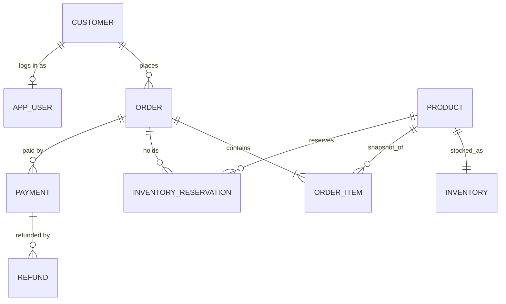

# Domain model

- **Money**: `numeric(12,2)`, single currency. Order lines snapshot sku/name/price at purchase.
- **Inventory**: `available = on_hand - reserved`; DB checks keep `0 <= reserved <= on_hand`.
- **Reservation**: HELD -> CONSUMED (shipped) or RELEASED (cancelled/expired/fully refunded before shipping).
- **Payment**: SUCCEEDED/FAILED attempts; `refund_committed` (pending + completed refunds) is bounded by `amount`.
  At most one SUCCEEDED payment per order (partial unique index).
- **Refund**: PENDING -> COMPLETED | FAILED (failure releases the balance).
- **Cross-cutting tables**: `idempotency_keys`, `outbox_events`, `audit_logs`. Every aggregate row carries `version`.
