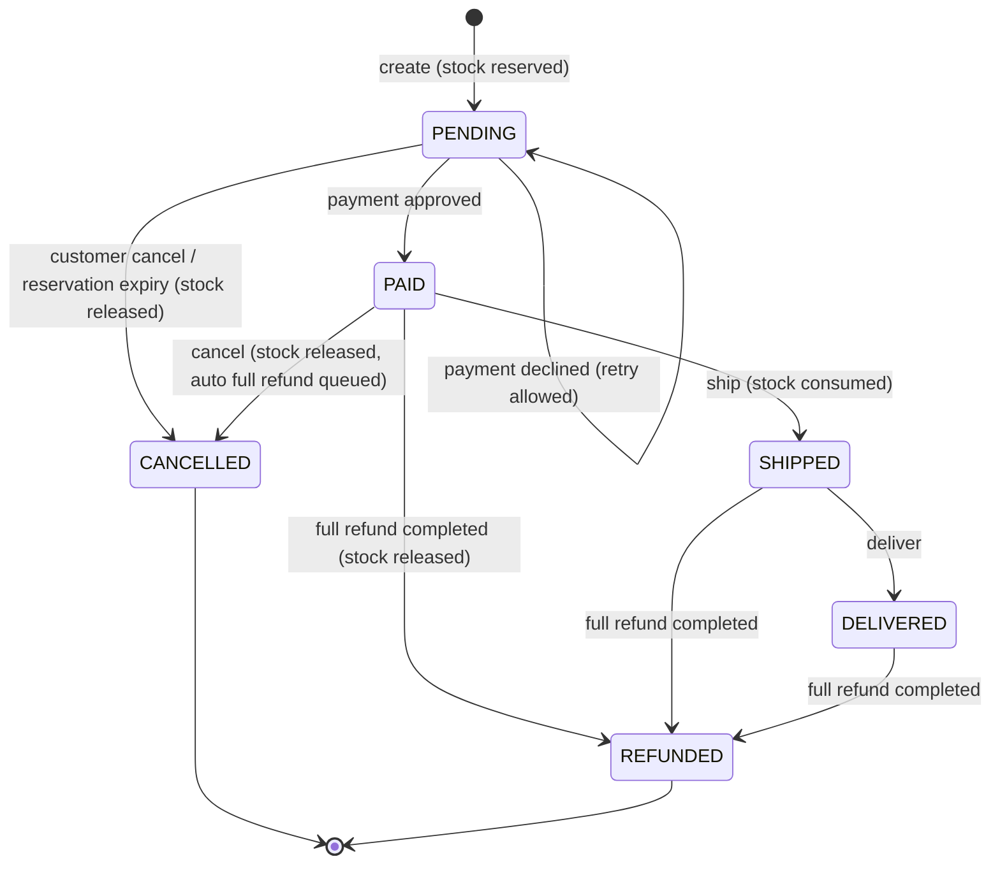
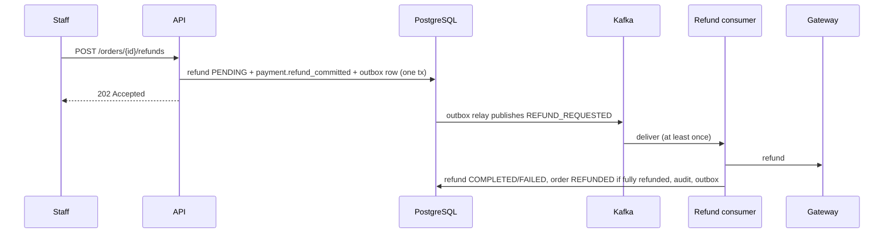

# Order lifecycle

Partial refunds do not change the order status. The transition table lives in `OrderStatus`; all changes go through
`CustomerOrder.transitionTo`, which returns `409 INVALID_STATE_TRANSITION` for illegal moves.

## Refund workflow

